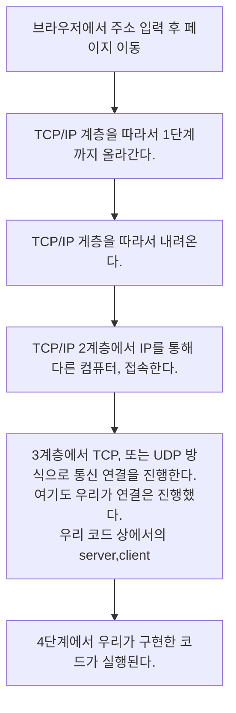
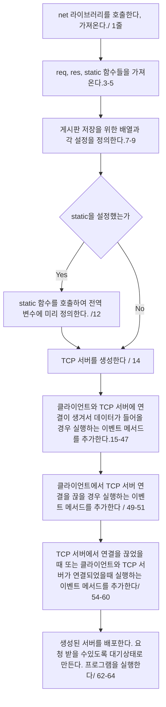
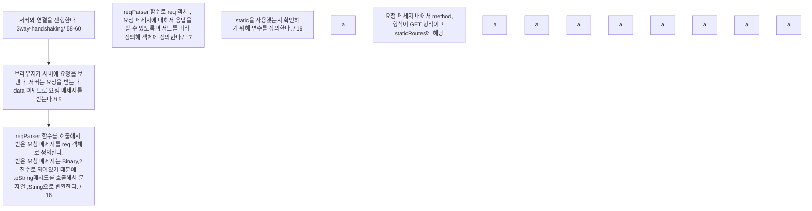

```mermaid
flowchart
    A[브라우저에서 주소 입력 후 페이지 이동] --> B;
    B[TCP/IP 계층을 따라서 1단계까지 올라간다.] --> C;
    C[TCP/IP 게층을 따라서 내려온다.] --> D;
    D[TCP/IP 2계층에서 IP를 통해 다른 컴퓨터, 접속한다.] --> E;
    E[3계층에서 TCP, 또는 UDP 방식으로 통신 연결을 진행한다.\n여기도 우리가 연결은 진행했다.\n우리 코드 상에서의 server,client] --> F
    F[4단계에서 우리가 구현한 코드가 실행된다.]

```

# 구현된 코드상에서의 흐름 (index.js파일)

```mermaid
flowchart
    A[net 라이브러리를 호출한다, 가져온다./ 1줄] --> B
    B[req, res, static 함수들을 가져온다.3-5] --> C
    C[게시판 저장을 위한 배열과 각 설정을 정의한다.7-9] --> D
    D{static을 설정했는가} --> |Yes| J
    J[static 함수를 호출하여 전역 변수에 미리 정의한다. /12] --> E
    D -->|No| E
    E[TCP 서버를 생성한다 / 14 ] --> F
    F[클라이언트와 TCP 서버에 연결이 생겨서 데이터가 들어올 경우 실행하는 이벤트 메서드를 추가한다.15-47] --> G
    G[클라이언트에서 TCP 서버 연결을 끊을 경우 실행하는 이벤트 메서드를 추가한다 / 49-51] --> H
    H[TCP 서버에서 연결을 끊었을 때 또는 클라이언트와 TCP 서버가 연결되었을때 실행하는 이벤트 메서드를 추가한다/ 54-60 ] --> I
    I[생성된 서버를 배포한다. 요청 받을 수있도록 대기상태로 만든다. 프로그램을 실행한다/ 62-64]
```

# 브라우저에서 접속햇을때의 흐름

```mermaid
    flowchart
    A[서버와 연결을 진행한다. 3way-handshaking/ 58-60]
    B[브라우저가 서버에 요청을 보낸다. 서버는 요청을 받는다. data 이벤트로 요청 메세지를 받는다./15]
    C[reqParser 함수를 호출해서 받은 요청 메세지를 req 객체로 정의한다.\n받은 요청 메세지는 Binary,2진수로 되어있기 때문에 toString메서드를 호출해서 문자열 ,String으로 변환한다. / 16]
    D[reqParser 함수로 req 객체 , 요청 메세지에 대해서 응답을 할 수 있도록 메서드를 미리 정의해 객체에 정의한다./ 17]
    E[static을 사용했는지 확인하기 위해 변수를 정의한다. / 19]
    F{static을 사용하는가?}
    F1[요청 메세지 내에서 method,형식이 GET 형식이고 staticRoutes에 해당 ]
    F[a]
    G[a]
    H[a]
    I[a]
    J[a]
    K[a]
    L[a]
    M[a]
    N[a]

    A-->B-->C
```
