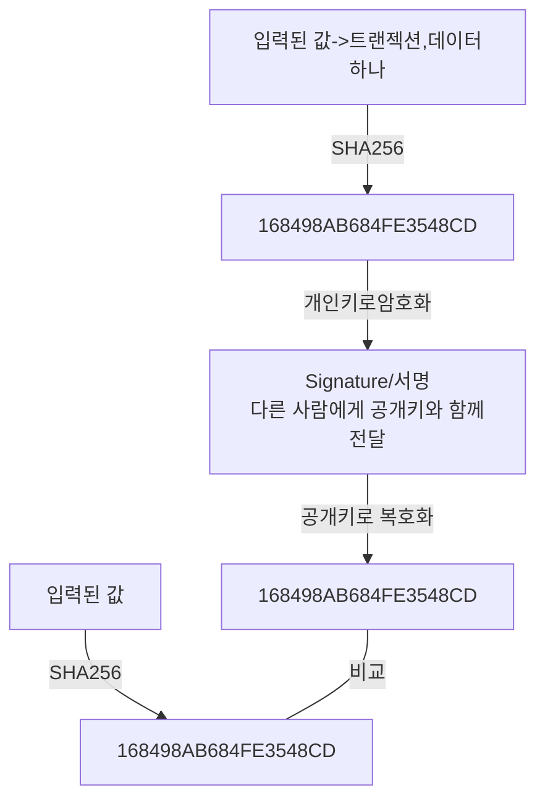

# 암호화

- 블록체인에서 누가 했는지, 즉 신원을 확인하기 위해서 양방향
  암호화를 사용한다.
- 지금까지 다뤄왔던 Hash(SHA256)는 단방향 암호화로 복호화가 불가능하다.
- 양방향 엄호화는 암호화 + 복호화 모두 가능하다.
- 해시 16진수 (64자리)
- 16의 64승이 최대

## 비대칭 암호화

- 블록체인에서 사용하는 양방향 암호화는 개인키와 공개키로 이루어진
  비대칭 암호화이다.

- 대칭 VS 비대칭
- 대칭 암호화(암호화할때 복호화할때 같은키사용)

- 대칭 암호화

- 비대칭 암호화(암호화 복호화 다른키 사용)

- 개인키는 안전하게 보관할수있으며 암호문과 공개키를
  상대에게 공유함으로써 데이터를 확인할 수 있다.

- 공개키로 복호화(암호화된데이터를 확인하는거) 할 수있는 암호문은 연결된 개인키로 생성한
  암호문 뿐이어야한다.

- 블록체인에서 어떻게 사용하는가? 두번암호화함 sha256이랑 개인키암호화 peer확인하려고 함

- npm list -g 전역에 깔린거 확인
  "dependencies": {
  "crypto-js": "^4.1.1" npm i -D ctypeto-js
  },
  "devDependencies": {
  "@types/crypto-js": "^4.1.1" npm i -D @types/crypto-js 패키지에대한 타입
  }

  ts-node index로 실행

# 타원곡선

- 암호화 알고리즘 중 하나(elliptic curve cryptography)
- 개인키와 공개키를 만들기 위해서 사용한다(SHA256은 hash암호화)
- RSA(미국 MIT에서 개발한 공개키 암호 시스템)를 안쓰고 이걸 쓰는이유
- 동일한 안정성을 가지면서도 RSA보다 짧은 키를 사용한다.
- 휴대폰 등 계산을 많이 할수 없는(성능이 떨어지는) 환경에서 사용된다.

- 타원곡선에서 사용하는 함수
- y^2 = x^3 + ax + b
- 비트코인과 이더리움에서 사용하는 함수는 y^2 = x^3 +7 이다
  (^은제곱임) 이걸써서 암호화를 한다.

- 타원곡선에서의 덧셈 규칙

- P + Q + R = 0 ( +가 +가이나고 0은 0이아니다)
- -R=P+Q P+Q 접선그은 만나는점을 의미
- 더하고 반대쪽이 그값이된다 2P -> 3P -> 4P 앞에 숫자 2등은 개인키 kP는 공개키 앞에 숫자가 개인키 이동후 나온 kP는 공개키 P붙은게 공개키다 kP면 k가 개인키고 kP가 공개키
- 공개키를 만들때 개인키를 그만큼 돌려서 찾음

- 개인키(k)
- 임의의 점 P를 더하여 새로운 점을 찾은 횟수

- 공개키(kP)
  -P를 k번 더해서 찾은 점(x,y)

-기준점(G)

- 이더리움과 비트코인에서 공개키를 구하기 위해 사용하는 점
- G = 02 79BE667E F9DCBBAC 55A06295 CE870B07 029BFCDB 2DCE28D9 59F2815B 16F81798 << 실제 사용하고 있는것

- 개인키(k)가 너무 크기 때문에 계산에 있어서 알고리즘을 사용한다.
  -Double-and-Add 알고리즘을 사용한다.
  - 타원 곡선 알고리즘을 계산할때 k가 너무 크기 때문에 빠르게 돌리기위해서 사용한다.
- 횟수를 2진수로 표기후 0또는 1을 더하도록 처리한다.
- 35 횟수를 예시로 아래의 순서를 진행하겠다.

  1.  35 = 2진수로 100011
  2.  첫 자리의 1부터 시작하여 G를 더한다. => 0 \* \* 2 + G = G
  3.  두번째 자리는 0이기 때문에 G \* 2 = 2G
  4.  세번째 자리는 0이기때문에 2G \* 2 = 4G
  5.  네번째 자리는 0이기 때문에 4G \* 2 = 8G
  6.  다섯번째 자리는 1이기 때문에 8G \* 2 + G = 17G
  7.  여섯째 자리는 0이기 때문에 17G \* 2 + G = 35G -공식으로 보자면 "이전값 \* 2 + 2진수(0,1) \* G"

  - 개인키가 16진수로된 64자리의 수 => 16^64 => 이만한 횟수가 256으로 끝난다. 32 bytes => 256 bits(10100100111010100...<< 256 갯수 )

# 지갑

- 지갑에서 계정을 생성할 경우 개인키와 공개키를 생성한다.
- 공개키를 사용해서 지갑 주소를 만든다.
- 비트코인
- 암호화를 여러번 거친 후에 사용한다.
- 이더리움 -뒤에서부터 40자만 사용한다.
