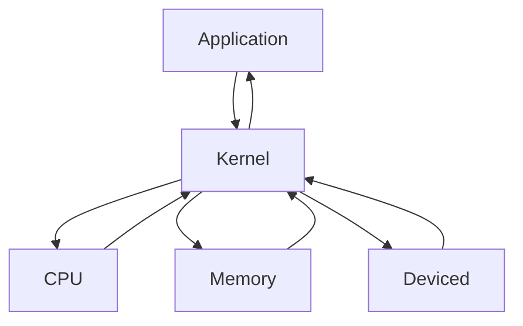

# VM

- Virtual Machine의 약자
- OS 내에서 다른 OS를 설치, 실행하는 프로그램
- LPPlayer 등을 포함하는 안드로이드 플레이어 , Java에서 사용하는 JVM, Ehtereum에서 사용하는 EVM, Windows/Linux/Android등 거의 모든 OS를 설치 할수잇는
  VMWare등
- 단점으로는 물리적인 컴퓨터, 즉 하드웨어의 성능을 본래의 OS와 나누게된다 -> 성능 저하를 일으킨다.

# Kernel

- 커널이란 하드웨어와 프로그램을 연결해주는 프로그램이다.
- 운영체제(OS)에 포함되어있다.



# WSL

- Windows SubSystem for Linux
- 윈도우에서 Linux OS를 사용하게 해주는 서비스
- Linux OS에는 Ubuntu, cent OS, Redhat 등이 있다.
  - Lunux는 Unix 기반의 OS이다.
  - Mac OS도 Unix 기반의 OS이다.
- WSL은 VM과 조금은 다르다. -> VM이 OS상에서 다른 OS를 설치, 사용->
  VM은 하드웨어 성능을 나눠서 사용하지만 WSL은 Linux의 기반을 설치하지 않고 Windows의 기반을 사용하여 Linux를 실행한다.
- Linux의 커널을 사용하지 않는다.
- 성능 저하가 그렇게 크지 않다.
- 예전에는 OS 충돌이 있었으나 많은 패치로 요즘은 상당히 적어진 상태

- 우분투 기반 익숙해지기위해배움

# 설치

- 기초 확인 사항

1. 윈도우 버전이 20H1 이상일때 사용가능

1. 제어판 -> 프로그램 제거 -> 왼쪽에 Windows 기능 켜기/끄기

- Linux용 Windows 하위 시스템

2. Microssoft store에서 windows Terminal설치
   -PowerShell과 같은 걸로 나온다.

   - WSL 사용에 있어서 termianl을 권장
   - 터미널이라는게 설치됨(자세히 관리자권한으로 실행)

3. terminal에서 아래의 명령어를 입력

```sh
dism.exe /online /enable-feature /featurename:Microsoft-Windows-Subsystem-Linux /all /norestart
```

-배포 이미지 관리

```sh
dism.exe /online /enable-feature /featurename:VirtualMachinePlatform /all /norestart
```

- 가상 머신 활성화

4. 아래의 명령어로 설치 가능한 Linux OS를 확인할수있다

```sh
wsl --list --online
```

5. 우분투 설치

```sh
wsl --install -d Ubuntu
```

-wsl -l -v 버전확인

6. Enter new Unix username

- 사용자 이름 입력
  New Password
- 비밀번호 입력

7. WSL2를 사용하기 위해 아래 프로그램 설치
   https://learn.microsoft.com/ko-kr/windows/wsl/install-manual#step-4---download-the-linux-kernel-update-package

-설치가 끝나면 다시시작

8. WSL의 버전을 확인하기 위해 아래의 명령어 사용

```sh
wsl -l -v
```

9. WSL 2 버전 사용하기

```sh
wsl --set-version Ubuntu 2
```

10. 터미널에서 우분투 열기

```sh
wsl
```

- 나갈땐 exit

11. WSL에서 삭제하고 싶을 때

```sh
wsl -unregister Ubuntu
```

- 우분투로 실행하면 홈경로로 들어가고 터미널에서 실행하면
  터미널 경로로 들어감
- 내px에서 밑에 linux들어가면 파일 볼수있음
- home파일 들어가면 우분투상에서 홈경로랑 같다

# 기본적인 명령어들

- cd -폴더 이동

  - / : Root 경로(최상위 경로)
  - ~ :Home 경로(/home/사용자 이름)

- pwd -현재 경로 출력

- ls -현재 폴더의 내용을 출력
- 옵션으로 대표적으로 a와 l를 사용
- ls -al : 권한 용량 등 모든 파일/폴더를 출력(숨긴 파일 포함)
- mkdir
  - 폴더 생성
- clear
  - 화면 초기화
- curl
  - 인터넷 접근(요청)

# Node.js

-설치

```sh
sudo apt-get update 로 업데이트함
sudo apt-get upgrade로 업그레이드까지하기
sudo apt-get install nodejs
```

- 업데이트 업그레이트는 ubuntu자체를 업데이트 업그레이드함
- node -v
- npm -v

- Ubuntu에서 Node.js는 최신버전으로 설치되지 않는다.
- 해결은 nvm을 사용한다.
- nvm : Node Version Manager
- Node.js의 버전을 관리한다.
- https://github.com/nvm-sh/nvm 사이트 들어가서
- 밑에 curl -o- https://raw.githubusercontent.com/nvm-sh/nvm/v0.39.3/install.sh | bash 찾아서 설치

- nvm치면 notfound뜬다
- nvm의 명령어들
- nvm ls-remote : 설치 가능한 Node.js의 모든 버전을 보여준다.
- nvm ls : 현재 설치된 Node.js버전을 보여준다. => 여러 버전을 설치후에 선택하여 사용할수있다.
- nvm install 16.18.0 :Node.js 버전 설치
- 버전은 vscode 에서 node -v 쳤을때의 버전이랑 맞추면됨

- 버전설치가 여러개면 nvm use 16.18.0 이런식으로 선택가능
- 16.18.0 버전을 사용한다

# Mac Os에서 프로그램 설치

- homebrew를 사용한다
- apt/apt-get 대신에 사용한다.
- brew install 이름
- /bin/bash -c "$(curl -fsSL https://raw.githubusercontent.com/Homebrew/install/HEAD/install.sh)"

- blockchain 폴더 만들어서 했던거 넣기 node_modules
  wallletdata빼고
  cd blockchain가서
  npm i
  ts-node src
  npm i -g typescript ts-node
  npm list -g
  ts-node src
